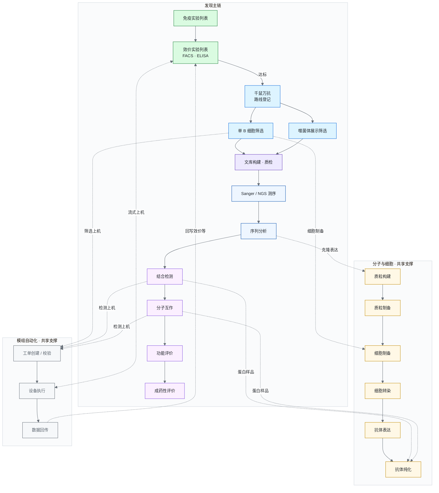
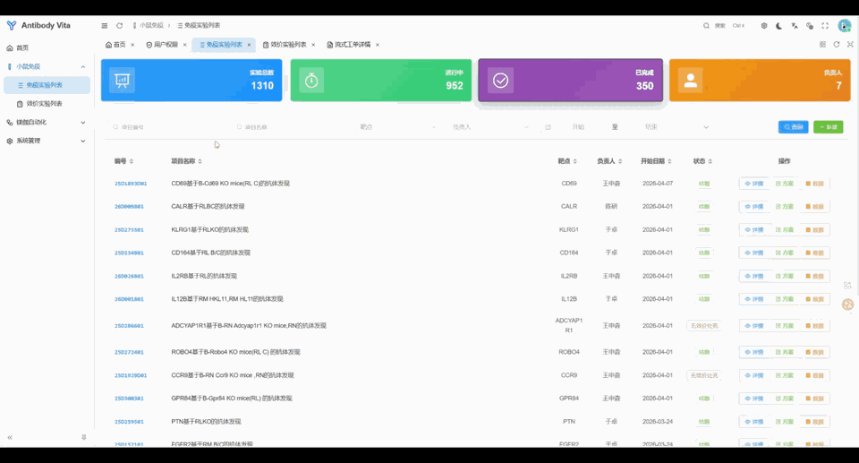

<!-- Showcase only. Implementation status & ops → docs/README.md -->

  

  <strong>Antibody Vita</strong> 
  抗体发现全流程实验协作平台

  

  
  
  
  

  <a href="./docs/README.md">文档</a> ·
  <a href="./docs/overview.md">仓库地图</a> ·
  <a href="./docs/deploy.md">部署</a>

---

##  项目简介

治疗性抗体发现通常不是一条直线，而是一套互相咬合的实验网络：先用动物免疫激发应答，用血清效价与多类检测（如 ELISA、流式）判断是否进入下一阶段；随后可走 **单 B 细胞筛选** 或 **噬菌体展示** 等路径，搭配文库构建与一代 / 二代测序拿到序列；再经质粒与细胞制备、转染、表达纯化乃至 LNP 等递送相关准备，进入结合、亲和力 / 分子互作、功能与理化成药性等评价。业内常见的高通量单细胞与展示类流程，也正是围绕「应答 → 筛选 → 序列 → 表达 → 表征」这条主链组织起来的。

**Antibody Vita**是为百奥赛图免疫研发搭建的抗体发现全流程协作平台。它把这条主链及其并行支撑环节放进同一套 Web 系统：按真实实验路径串联数据与工单，让同一业务事实尽量只存一处；对需要上机的步骤，用「工单 → 下发 → 回传」把自动化模组接进主流程——目标是贯通发现全链路，而不是把零散 Excel 原样搬进网页。

## 平台能力范围

面向自免疫至候选抗体评价的完整研发工作：

- **小鼠免疫与效价** — 免疫项目管理、笼位与进度跟踪；效价相关检测与附件管理（含 FACS、ELISA 等），作为进入发现下游的入口  
- **筛选与发现** — 千鼠万抗总览与路线分流；**单 B 细胞筛选**、**噬菌体展示筛选** 等并行路径  
- **文库与测序** — NGS / 噬菌体展示文库构建与质检；Sanger 与 NGS 测序及序列分析  
- **分子与细胞支撑** — 质粒构建与制备、细胞制备与转染、抗体表达与纯化，以及流程中的递送 / 制备类支撑（如 LNP 相关准备）  
- **抗体评价** — 结合检测、分子互作（含亲和力表征）、功能评价与成药性 / 理化表征  
- **模组自动化与系统底座** — 实验设备对接与工单下发（如镁伽流式）；统一登录、权限、审计与功能开关，支撑全流程协作  

各模块按实验阶段分期建设；已落地能力与后续计划见 [docs/README.md](./docs/README.md)。

## 全流程示意

三层结构：**发现主链**（横向实线）自免疫经筛选、测序至评价贯通；**分子与细胞** 与 **模组自动化** 作为共享支撑层按需接入（虚线表示），可在效价流式检测、单 B 细胞筛选、重组表达及评价上机等环节复用，不纳入主链时序。

## 界面预览

  

## 技术栈

FastAPI · SQLAlchemy · Vue 3 / Vben Admin · MySQL

## 文档

[docs/README.md](./docs/README.md) — 业务全景、模块结构与开发计划  
[docs/overview.md](./docs/overview.md) — 仓库地图与当前路由  
[docs/deploy.md](./docs/deploy.md) — 环境、启动与运维  
[docs/auth-permissions.md](./docs/auth-permissions.md) — 认证与权限

## 许可

本仓库为 **专有软件（Proprietary）**，版权归  
**百奥赛图（北京）医药科技股份有限公司**  
（Biocytogen Pharmaceuticals (Beijing) Co., Ltd.）所有。  
未经书面授权，不得复制、分发或对外开源再发布。详见 [LICENSE](./LICENSE)。
