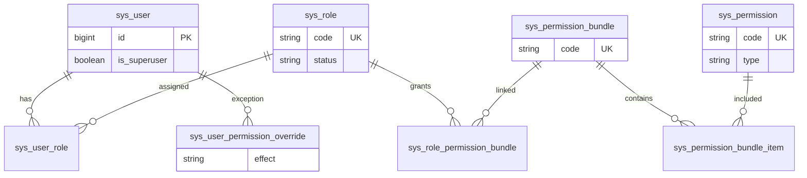
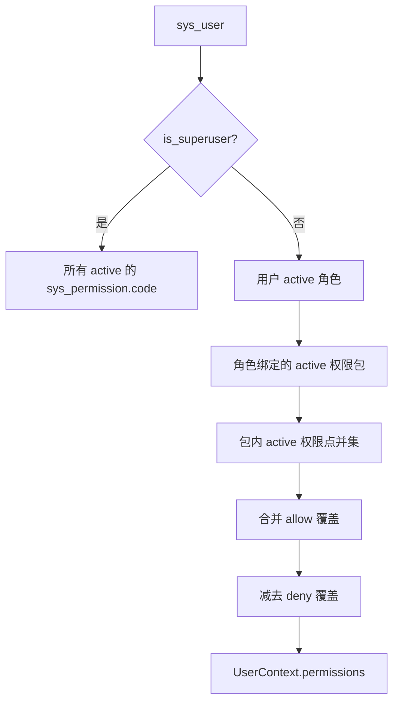
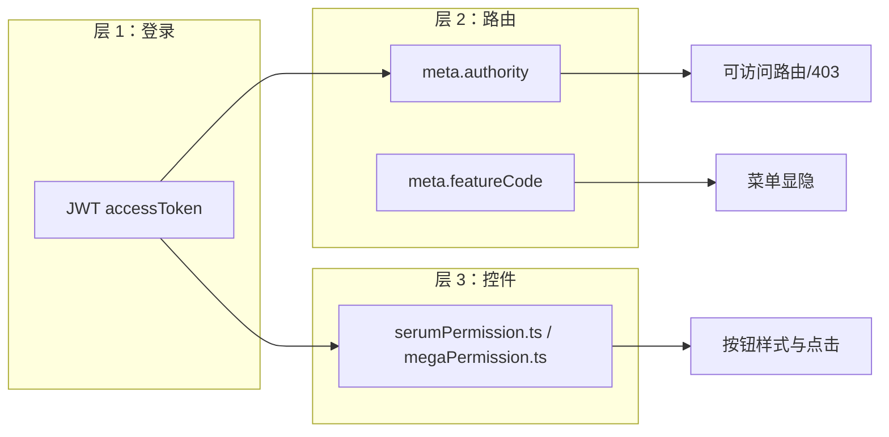
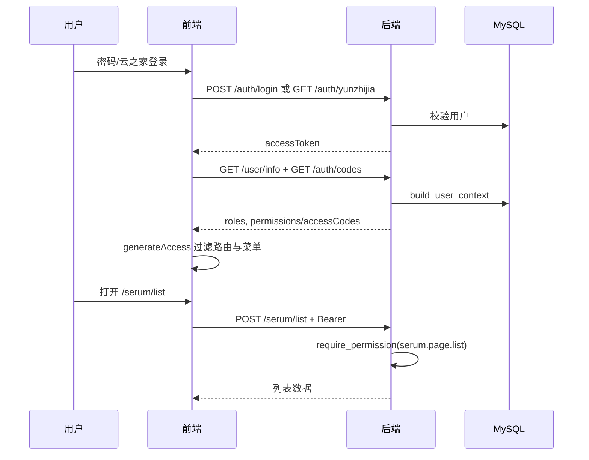

# 认证与权限

本文说明 Antibody Forge 的**完整权限逻辑**：数据模型、生效规则、前后端分工，以及血清业务的**项目负责人**二次校验。

## 1. 模型总览

权限采用 **RBAC + 权限包 + 个人覆盖**，与 `sys_user` 上的部门/组别等组织字段**解耦**。



| 表 | 作用 |
|----|------|
| `sys_user` | 账号；`is_superuser`  bypass 常规权限汇总 |
| `sys_role` | 角色（示例：`guest`、`operator`、`system_admin`；生产可完全自定义） |
| `sys_permission` | 原子权限点，`code` 全局唯一 |
| `sys_permission_bundle` | 权限包，便于按岗位批量授权 |
| `sys_permission_bundle_item` | 包 ↔ 权限点多对多 |
| `sys_user_role` | 用户 ↔ 角色 |
| `sys_role_permission_bundle` | 角色 ↔ 权限包 |
| `sys_user_permission_override` | 个人例外：`allow` / `deny` |
| `sys_permission_api` | 接口路径 ↔ 权限点映射（**仅审计**，见 §6） |
| `sys_feature_flag` | 菜单/功能/任务开关（**非** RBAC） |
| `sys_operation_log` | 写操作审计 |

DDL 与种子见 [vita-database.sql](./vita-database.sql)。

## 2. 权限点编码约定

格式：`<模块>.<资源类别>.<动作>`，例如 `serum.project.edit`。

| `type` | 含义 | 典型用途 |
|--------|------|----------|
| `page` | 页面级 | 控制路由 `meta.authority`、能否进入某页 |
| `action` | 操作级 | 控制按钮显隐；后端写接口及少量读接口 `require_permission` |

### 2.1 血清模块（`serum.*`）

| 权限码 | 类型 | 说明 |
|--------|------|------|
| `serum.page.list` | page | 免疫实验列表 |
| `serum.page.detail` | page | 详情页 |
| `serum.page.edit` | page | 编辑页 |
| `serum.page.titer` | page | 效价数据页 |
| `serum.page.titer_order` | page | 效价实验列表 |
| `serum.page.cell` | page | 细胞及库存页 |
| `serum.project.create` | action | 新建项目 |
| `serum.project.edit` | action | 编辑**本人负责**项目 |
| `serum.project.edit_all` | action | 编辑**任意**项目（含改负责人） |
| `serum.project.delete` | action | 删除项目 |
| `serum.status.update` | action | 快速改状态（§4.2） |
| `serum.status.auto_update` | action | 批量自动更新状态 |
| `serum.mouse.export` | action | 导出小鼠免疫数据 |
| `serum.cage.update` | action | 更新笼位 |
| `serum.titer.edit` | action | 编辑效价（免疫负责人、效价负责人，或 `edit_all`） |
| `serum.titer.edit_all` | action | 编辑任意项目效价 |
| `serum.file.manage` | action | 效价附件增删改 |
| `serum.cell.view` | action | 细胞库存数据（进页面还需 `serum.page.cell`） |
| `serum.cell.prep_status.update` | action | 更新任意项目制备状态（细胞库存页） |
| `serum.titer_order.edit` | action | 新建/编辑效价工单（含批次信息：笼位、采血、只数、检测方法等） |
| `serum.titer_order.delete` | action | 删除效价工单 |
| `serum.titer_order.owner.edit` | action | 编辑效价负责人列 |
| `serum.titer_order.record.edit` | action | 编辑检测日期、血清状态、备注、效价小结（需为效价或免疫负责人，或 `record.edit_all`） |
| `serum.titer_order.record.edit_all` | action | 编辑任意工单检测记录字段（含效价小结） |

### 2.2 镁伽模块（`mega.*`）

| 权限码 | 类型 | 说明 |
|--------|------|------|
| `mega.page.flow_work_order` | page | 流式工单总览与详情 |
| `mega.flow_work_order.edit` | action | 保存、校验、删除、作废工单 |
| `mega.flow_work_order.dispatch` | action | 发送、撤回/停止/继续、确认执行、完成/失败及设备暂停确认等调度操作 |

**Labillion 回调** `POST /api/mega-automation/labillion/callback` **无需登录**（镁伽服务器推送）；路由层不调用 `require_permission`，响应恒为 HTTP 200。

**主动状态同步** `POST .../sync-labillion-status` 使用 `mega.page.flow_work_order`（与详情只读同级），供详情页进入时拉取镁伽最新状态；**不登记** `sys_permission_api`（非人员主动操作，不进操作日志）。

**手动执行定时任务** `POST /api/system/features/jobs/run` 需 `system.feature.manage`；body `{ "job_code": "job.xxx" }`。后台线程执行，结果记入 `sys_job_run_log` 与操作日志。

镁伽接口**无**项目负责人式行级归属，仅按上述权限点鉴权。

### 2.3 系统模块（`system.*`）

| 权限码 | 类型 | 说明 |
|--------|------|------|
| `system.page.user` / `role` / `permission` / `operation_log` | page | 用户权限管理页（进路由） |
| `system.page.feature` | page | 系统功能页 |
| `system.user.manage` | action | 用户增删改、重置密码、批量角色 |
| `system.role.manage` | action | 角色 CRUD |
| `system.permission.manage` | action | 权限包、权限点、个人覆盖 |
| `system.operation_log.view` | action | 查看操作日志 |
| `system.feature.manage` | action | 修改功能开关、定时任务配置；手动执行定时任务（查看用 `page.feature`） |

**page 与 action**：`page.*` 管进路由；Tab 与写接口靠对应的 `manage` / `view` action。

### 2.4 权限包与角色（示例种子）

`docs/vita-database.sql` 文末的权限包 / 角色**仅为克隆空库示例**，生产环境在后台完全自定义；新增页面时只需在 `sys_permission` 登记权限点，**不必**同步改示例包。

示例三档（角色 code 与权限包 code 相同，1:1 绑定）：

| 角色 / 包 code | 名称 | 大致范围 |
|----------------|------|----------|
| `guest` | 访客 | 血清 / 镁伽 / 系统各 **page** 只读，外加 `serum.cell.view`、`system.operation_log.view` |
| `operator` | 业务员 | 血清 + 镁伽日常编辑；无 `edit_all`、`auto_update`、删工单等管理权限 |
| `system_admin` | 系统管理 | `system.*` 全部 10 个权限点 |

**超级管理员**不走上表：`sys_user.is_superuser=TRUE` 即 bypass 全部权限，**无需**绑定角色或权限包（见 `vita-database.sql` 文末注释）。

实际授权流程：**给用户分配角色** → 角色绑权限包 → 展开为权限点；另可对单用户设置 `allow` / `deny` 覆盖。

## 3. 后端：权限如何计算

实现：`bbctg_vita_server/modules/system/permissions.py`。



规则摘要：

1. **超级管理员**（`is_superuser=true`）：拥有库中全部 `active` 权限码；库为空时使用代码内 `ALL_FALLBACK_CODES`。**不依赖**角色与权限包。
2. **普通用户**：`角色 → 权限包 → 权限点` 去重；仅统计 `status=active` 的角色、包、权限点。
3. **个人覆盖**：`allow` 并入集合，`deny` 从集合移除（deny 优先）。
4. **组织字段**（部门、组别、职位等）不参与上述计算。

校验 API：

```python
has_permission(db, user, code)      # 判断
require_permission(db, user, code)  # 无权限则 HTTP 403
```

登录后上下文通过 `build_user_context` 生成，并在 `/api/user/info`、`/api/auth/codes` 下发给前端（`permissions` 与 `accessCodes` 内容相同）。

## 4. 后端：接口鉴权与业务规则

### 4.1 认证入口

| 方式 | 路由 | 说明 |
|------|------|------|
| 账号密码 | `POST /api/auth/login` | 校验 `password_hash`，写登录日志 |
| 云之家 | `GET /api/auth/yunzhijia?ticket=` | `openid` 绑定 `sys_user`；未绑定且 env `YUNZHIJIA_AUTO_PROVISION=false` 则 403 |
| 当前用户 | `Depends(get_current_user)` | 解析 JWT `sub` → 用户 id，`status=active` |

JWT 由 `SECRET_KEY` 签名；所有业务路由默认需携带 `Authorization: Bearer <token>`。

**无需权限点**的接口（仍需登录）：

- `PUT /api/auth/user/profile` — 个性名片
- `POST /api/auth/user/change_password` — 设置/修改本人密码（≥6 位，不需原密码）

### 4.2 血清：权限 + 项目负责人

部分接口在 `require_permission` 之后还有**数据归属**判断（`serum/routes.py`、`titer/routes.py`）：

| 场景 | 规则 |
|------|------|
| 保存项目（有 id） | 当前负责人且改后仍为自己 → `serum.project.edit`；否则 `serum.project.edit_all` |
| 新建项目 | `serum.project.create`；无 `edit_all` 时只能把自己设为 `owner` |
| 改笼位 | `serum.cage.update` + 项目负责人或 `edit_all` |
| 改状态 | 项目负责人：`status.update` 或 `titer.edit`；非负责人：`status.update`+`edit_all`，或 `titer.edit`+`titer.edit_all` |
| 鼠号分组查询 / 鼠号明细保存 | `serum.project.edit` / `edit_all` / `serum.titer.edit` / `titer.edit_all` **任一** |
| 导出免疫方案（Excel/PDF） | `serum.page.detail` |
| 细胞库存 | `serum.cell.view`（页面还需 `page.cell`） |
| 改制备状态 | `serum.cell.prep_status.update` |
| 效价只读 | `serum.page.detail` 或 `serum.page.titer` |
| 效价写 | 对应 action + 项目负责人、效价负责人或 `titer.edit_all` |
| 效价工单（批次/删除/负责人） | 对应 `titer_order.*` action，无归属校验 |
| 效价工单（检测记录） | `record.edit` + 负责人或 `record.edit_all` |
| 自动更新状态 | `serum.status.auto_update` |

负责人匹配：用户 `username` / `display_name`（前端下发为 `realName`）与项目 `owner` 字符串比对（含姓名首段别名）。

> **安全边界**：前端按钮隐藏不能代替后端校验；所有写接口以 `require_permission` 及上述归属逻辑为准。

### 4.3 镁伽：仅权限点鉴权

流式工单读写与调度（`mega_automation/routes.py`）分别校验 `mega.page.flow_work_order`、`mega.flow_work_order.edit`、`mega.flow_work_order.dispatch`，无额外数据归属判断。

## 5. 前端：三层控制



### 5.1 路由与菜单（层 2）

- **访问模式**：`accessMode: 'frontend'`（`bbctg_vita_web` 默认配置）。
- 登录后拉取用户信息与权限码，用**角色 + 权限码**匹配 `meta.authority` 过滤路由。
- 路由 `meta.authority` 声明进入页面所需的**任一**权限码（OR 关系）。
- `meta.featureCode` 对应 `sys_feature_flag`：控制菜单是否显示、排序；与 RBAC 正交。拉取失败时隐藏受控菜单项。
- 父级路由需配置 `authority`（如 `/system`），否则子路由全被过滤后仍可能出现空目录。

路由定义位置：`apps/antibody_vita/src/router/routes/modules/*.ts`。

### 5.2 按钮与交互（层 3）

血清页使用 `utils/serumPermission.ts`，大体与 §4.2 对齐，例如：

- `canEditSerumProject` → `edit_all` 或（`project.edit` 且 owner）
- `canUpdateSerumStatus` → `status.update` 且（owner 或 `edit_all`）；**比后端略严**（后端负责人还可凭 `titer.edit` 改状态，见 §4.2）
- `canEditSerumTiter` → `titer.edit` 且（owner、效价负责人或 `titer.edit_all`）

镁伽流式工单使用 `utils/megaPermission.ts`：`canEditMegaFlowWorkOrder`、`canDispatchMegaFlowWorkOrder`。

系统管理页各 Tab 按 `system.*.manage` / `operation_log.view` 显隐。

无权限时多为 `no-permission-btn` 样式，而非路由级 403。

### 5.3 个人中心

`/profile` 无 `authority`，凡已登录用户可访问。

### 5.4 系统首页（门户）

- **`/home`** 为系统级默认落地页（`defaultHomePath`、`build_user_info` 的 `homePath`）；用户可在首页快捷导航弹窗中覆盖为本机偏好路径；**不设 `meta.authority`**，凡已登录用户可访问（含零角色账号）。
- 侧栏「首页」`order: 0`；**门户 Hero** → **三列等宽**：公告中心+站内信 | 快捷导航+好书推荐+暖心便签 | 日历+使用提示。
- **系统快捷导航** 6 格（3×2）：右上角「自定义配置」弹窗内排布快捷入口；**点击已填入的格子**可勾选为登录后默认页（`HOME_START_PAGE_STORAGE_KEY`），新模块只需加入下方预设列表即可被用户选为默认，无需单独维护默认页清单。配置仅存浏览器 `localStorage`，**不落库**；未勾选时仍用服务端 `homePath`。
- 公告中心 / 站内信为固定高度列表区，超出滚动；点击查看全部（列表页待接 API）。
- 静态数据在 `views/Home/home-data.ts`；暖心便签仅存浏览器 `localStorage`。
- **北京天气**：前端 `useHomeWeather` 直连 **Open-Meteo** 与 **weather-api.site**，并行竞速取先返回者；30 分钟浏览器缓存；均无需注册或 API Key。

路由与页面：`apps/antibody_vita/src/router/routes/modules/home.ts`、`views/Home/`。

## 6. `sys_permission_api` 的真实用途

该表**不用于**请求拦截鉴权。

用途：HTTP **写请求**审计中间件（`modules/system/audit.py`）根据 `method + path` 匹配映射，写入 `sys_operation_log`。未登记的写接口不会自动记日志。本表**只应登记会实际落日志的写接口**；`GET` 以及挂在 `page`/`view` 上的查询类接口不要写入（即使写了也不会记）。

同一 path 何时需要多行：仅当审计文案需区分时（例如 `/save` 同时挂 `*.create` 与 `*.edit`，按 body 是否有 `id` 选型）。`edit` 与 `edit_all`（或多权限 OR 鉴权）**不必**各写一行，登记一条代表性写映射即可。

**操作日志展示**：列表分 **目标类型**（如「系统功能」「工单」）与 **目标** 两列。目标列优先显示 `target_label`；若与 `target_id` 不同则拼为 `名称 / ID 编码`（不再重复目标类型前缀）。示例：手动执行镁伽同步 → 目标类型「系统功能」，目标「镁伽工单状态同步 / ID job.mega_labillion_status_sync」。

**不宜登记**的写接口示例：`POST .../sync-labillion-status`（详情页自动刷新，非人员操作）。**应登记**的示例：`POST /api/system/features/jobs/run`（人员点击「立即执行」）。

权限校验始终在业务路由中显式调用 `require_permission`。

## 7. 功能开关（`sys_feature_flag`）

与 RBAC 分离，用于运行时配置（菜单显隐、部分业务能力、定时任务开关）。种子见 `vita-database.sql`；代码默认见 `modules/system/features.py`（库中多出的项如 `menu.mega_automation` 会合并进有效列表）。

| category | code | 作用 |
|----------|------|------|
| `menu` | `menu.serum`、`menu.serum.list`、`menu.serum.titer_order` | 免疫实验侧栏 |
| `menu` | `menu.mega_automation`、`menu.mega_automation.flow_work_orders` | 镁伽自动化侧栏 |
| `menu` | `menu.system`、`menu.system.user_permission`、`menu.system.features` | 系统管理侧栏 |
| `feature` | `feature.drm_file_security` | DRM 上传解密 / 下载加密（`drm_service.py` 读取；另需 env 与 SDK） |
| `feature` | `feature.yunzhijia_auto_provision` | 后台展示项；实际由 env `YUNZHIJIA_AUTO_PROVISION` 控制 |
| `job` | `job.employee_profile_sync` | 员工资料定时同步（默认 00:30） |
| `job` | `job.serum_auto_update_status` | 免疫状态定时更新（默认 01:00） |
| `job` | `job.mega_labillion_status_sync` | 镁伽工单状态同步（默认 02:00；未配 Labillion 地址时 skip） |

**定时任务页（系统功能）**：启用开关与执行时间**改完即写库**；cron 变更需**重启后端**后生效（配置项 `restart_required`）。「立即执行」随时可点，直接调对应 job 函数，local 未开 scheduler 也可用。

有效配置接口：`GET /api/system/features/effective`（前端 `getSystemEffectiveFeaturesApi`）。

## 8. 端到端流程（登录后访问血清列表）



## 9. 初始化

1. 执行 [vita-database.sql](./vita-database.sql)（含权限点、功能开关、示例角色）。
2. 按文件文末注释创建首个超管：`is_superuser=TRUE`，**不绑角色**；在 `bbctg_vita_server` 目录生成 `password_hash` 后执行 `INSERT`。
3. 云之家用户绑定 `openid`，或设置 env `YUNZHIJIA_AUTO_PROVISION=true` 允许自动开户。
4. 部署与验收见 [deploy.md](./deploy.md)。

## 10. 代码索引

|  Concern | 路径 |
|----------|------|
| 权限汇总 | `bbctg_vita_server/modules/system/permissions.py` |
| 写操作审计 | `bbctg_vita_server/modules/system/audit.py` |
| 功能开关 | `bbctg_vita_server/modules/system/features.py` |
| 系统管理 API | `bbctg_vita_server/modules/system/routes.py` |
| 血清 API | `bbctg_vita_server/modules/immunology/serum/routes.py` |
| 效价 API | `bbctg_vita_server/modules/immunology/titer/routes.py` |
| 细胞库存 API | `bbctg_vita_server/modules/immunology/cell/routes.py` |
| 镁伽 API | `bbctg_vita_server/modules/mega_automation/routes.py` |
| 认证 | `bbctg_vita_server/modules/auth/` |
| 路由守卫 | `bbctg_vita_web/apps/antibody_vita/src/router/guard.ts` |
| 系统首页 | `bbctg_vita_web/apps/antibody_vita/src/views/Home/` |
| 血清前端权限 | `bbctg_vita_web/apps/antibody_vita/src/utils/serumPermission.ts` |
| 镁伽前端权限 | `bbctg_vita_web/apps/antibody_vita/src/utils/megaPermission.ts` |
| ORM 模型 | `bbctg_vita_server/models/system.py` |
