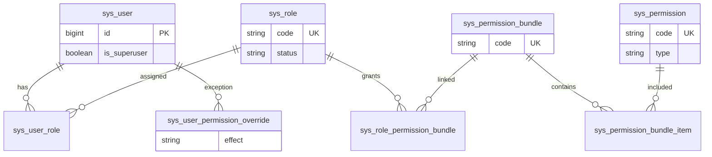
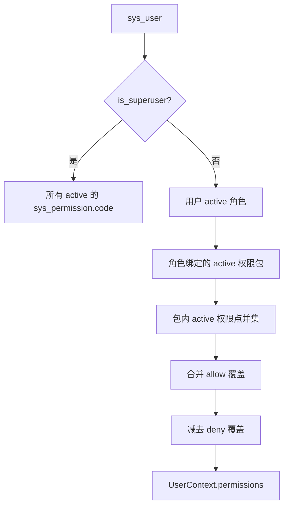
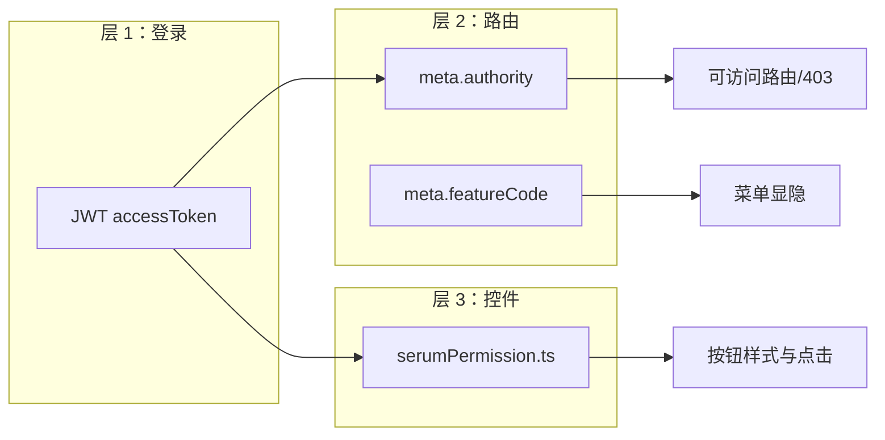
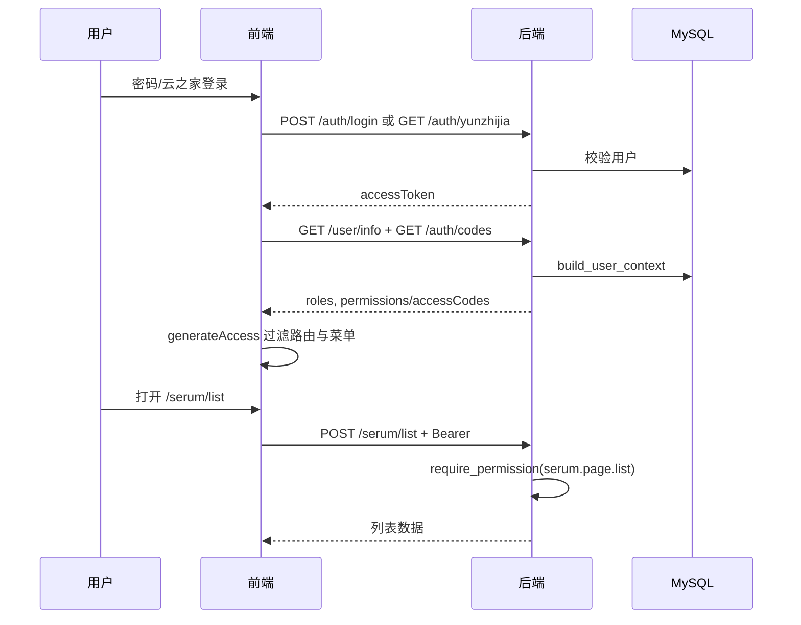

# 认证与权限

本文说明 Antibody Forge 的**完整权限逻辑**：数据模型、生效规则、前后端分工，以及血清业务的**项目负责人**二次校验。

## 1. 模型总览

权限采用 **RBAC + 权限包 + 个人覆盖**，与 `sys_user` 上的部门/组别等组织字段**解耦**。



| 表 | 作用 |
|----|------|
| `sys_user` | 账号；`is_superuser`  bypass 常规权限汇总 |
| `sys_role` | 角色（如 `serum_user`、`system_admin`） |
| `sys_permission` | 原子权限点，`code` 全局唯一 |
| `sys_permission_bundle` | 权限包，便于按岗位批量授权 |
| `sys_permission_bundle_item` | 包 ↔ 权限点多对多 |
| `sys_user_role` | 用户 ↔ 角色 |
| `sys_role_permission_bundle` | 角色 ↔ 权限包 |
| `sys_user_permission_override` | 个人例外：`allow` / `deny` |
| `sys_permission_api` | 接口路径 ↔ 权限点映射（**仅审计**，见 §6） |
| `sys_feature_flag` | 菜单/功能/任务开关（**非** RBAC） |
| `sys_operation_log` | 写操作审计 |

DDL 与种子数据见 [vita-database.sql](./vita-database.sql)（主库全表；外部细胞库 `sam_sample` 仅脚本末尾注释备查）。

## 2. 权限点编码约定

格式：`<模块>.<资源类别>.<动作>`，例如 `serum.project.edit`。

| `type` | 含义 | 典型用途 |
|--------|------|----------|
| `page` | 页面级 | 控制路由 `meta.authority`、能否进入某页 |
| `action` | 操作级 | 控制按钮显隐 + 后端写接口 `require_permission` |

### 2.1 血清模块（`serum.*`）

| 权限码 | 类型 | 说明 |
|--------|------|------|
| `serum.page.list` | page | 免疫实验列表 |
| `serum.page.detail` | page | 详情页 |
| `serum.page.edit` | page | 编辑页 |
| `serum.page.titer` | page | 效价数据页 |
| `serum.page.cell` | page | 细胞及库存页 |
| `serum.project.create` | action | 新建项目 |
| `serum.project.edit` | action | 编辑**本人负责**项目 |
| `serum.project.edit_all` | action | 编辑**任意**项目（含改负责人） |
| `serum.project.delete` | action | 删除项目 |
| `serum.status.update` | action | 快速改状态（需负责人或 edit_all） |
| `serum.status.auto_update` | action | 批量自动更新状态 |
| `serum.mouse.export` | action | 导出小鼠免疫数据 |
| `serum.cage.update` | action | 更新笼位 |
| `serum.titer.edit` | action | 编辑效价（负责人或 edit_all） |
| `serum.titer.edit_all` | action | 编辑任意项目效价 |
| `serum.file.manage` | action | 效价附件增删改 |
| `serum.cell.view` | action | 查看细胞库存 |
| `serum.cell.prep_status.update` | action | 更新任意项目制备状态（细胞库存页） |

### 2.2 系统模块（`system.*`）

| 权限码 | 类型 | 说明 |
|--------|------|------|
| `system.page.user` / `role` / `permission` / `operation_log` | page | 用户权限管理页各 Tab |
| `system.page.feature` | page | 系统功能页 |
| `system.user.manage` | action | 用户 CRUD、重置密码、批量角色 |
| `system.role.manage` | action | 角色 CRUD |
| `system.permission.manage` | action | 权限包、个人覆盖 |
| `system.operation_log.view` | action | 查看操作日志 |
| `system.feature.manage` | action | 功能开关与任务日志 |

### 2.3 预置权限包与角色

**权限包**（节选）：

| 包 code | 面向 |
|---------|------|
| `serum_readonly` | 只读查看 |
| `serum_scheme_edit` | 方案与状态、笼位、制备状态 |
| `serum_titer_edit` | 效价与附件 |
| `serum_admin` | 血清全部权限 |
| `system_admin` | 系统管理全部权限 |

**预置角色 → 权限包**：

| 角色 code | 绑定权限包 |
|-----------|------------|
| `super_admin` | 全部包 |
| `serum_admin` | `serum_admin` |
| `serum_user` | `serum_scheme_edit` + `serum_titer_edit` |
| `readonly` | `serum_readonly` |

实际授权流程：**给用户分配角色**；角色通过权限包展开为权限点列表。另可对单用户设置 `allow`/`deny` 覆盖。

## 3. 后端：权限如何计算

实现：`bbctg_vita_server/modules/system/permissions.py`。



规则摘要：

1. **超级管理员**（`is_superuser=true`）：拥有库中全部 `active` 权限码；库为空时使用代码内 `ALL_FALLBACK_CODES`。
2. **普通用户**：`角色 → 权限包 → 权限点` 去重；仅统计 `status=active` 的角色、包、权限点。
3. **个人覆盖**：`allow` 并入集合，`deny` 从集合移除（deny 优先）。
4. **组织字段**（部门、组别、职位等）不参与上述计算。

校验 API：

```python
has_permission(db, user, code)      # 判断
require_permission(db, user, code)  # 无权限则 HTTP 403
```

登录后上下文通过 `build_user_context` 生成，并在 `/api/user/info`、`/api/auth/codes` 下发给前端（`permissions` 与 `accessCodes` 内容相同）。

## 4. 后端：接口鉴权与业务规则

### 4.1 认证入口

| 方式 | 路由 | 说明 |
|------|------|------|
| 账号密码 | `POST /api/auth/login` | 校验 `password_hash`，写登录日志 |
| 云之家 | `GET /api/auth/yunzhijia?ticket=` | `openid` 绑定 `sys_user`；未绑定且未开 `YUNZHIJIA_AUTO_PROVISION` 则 403 |
| 当前用户 | `Depends(get_current_user)` | 解析 JWT `sub` → 用户 id，`status=active` |

JWT 由 `SECRET_KEY` 签名；所有业务路由默认需携带 `Authorization: Bearer <token>`。

**无需权限点**的接口（仍需登录）：

- `PUT /api/auth/user/profile` — 个性名片
- `POST /api/auth/user/change_password` — 设置/修改本人密码（≥6 位，不需原密码）

### 4.2 血清：权限 + 项目负责人

部分接口在 `require_permission` 之后还有**数据归属**判断（`serum/routes.py`、`titer/routes.py`）：

| 场景 | 规则 |
|------|------|
| 保存项目（有 id） | 当前负责人且保持自己为负责人 → 需 `serum.project.edit`；否则需 `serum.project.edit_all` |
| 新建项目 | 需 `serum.project.create`；普通用户只能把自己设为 `owner` |
| 改状态 / 笼位 | 需对应 action 权限，且为项目负责人 **或** 拥有 `serum.project.edit_all` |
| 改制备状态（细胞库存页） | 仅需 `serum.cell.prep_status.update` |
| 效价写操作 | 需 `serum.titer.edit` 等，且为项目负责人 **或** `serum.titer.edit_all` |
| 自动更新状态 | 需要 `serum.status.auto_update` |

负责人匹配：用户 `display_name` / `realName` / `username` 与项目 `owner` 字符串比对（含首段别名）。

> **安全边界**：前端按钮隐藏不能代替后端校验；所有写接口以 `require_permission` 及上述归属逻辑为准。

## 5. 前端：三层控制



### 5.1 路由与菜单（层 2）

- **访问模式**：`accessMode: 'frontend'`（`bbctg_vita_web` 默认配置）。
- 登录后 `router/guard.ts` 用 `roles` + `accessCodes`（权限码列表）过滤 `accessRoutes`。
- 路由 `meta.authority` 声明进入页面所需的**任一**权限码（OR 关系）。
- `meta.featureCode` 对应 `sys_feature_flag`：控制菜单是否显示、排序；与 RBAC 正交。拉取失败时隐藏受控菜单项。
- 父级路由需配置 `authority`（如 `/system`），否则子路由全被过滤后仍可能出现空目录。

路由定义位置：`apps/antibody_vita/src/router/routes/modules/*.ts`。

### 5.2 按钮与交互（层 3）

血清页使用 `utils/serumPermission.ts`，逻辑与后端归属规则对齐，例如：

- `canEditSerumProject` → `edit_all` 或 (`project.edit` 且为 owner)
- `canUpdateSerumStatus` → 有 `status.update` 且（`edit_all` 或 owner）
- `canUpdateSerumPrepStatus` → 有 `serum.cell.prep_status.update` 即可

无权限时多为 `no-permission-btn` 样式，而非路由级 403。

### 5.3 个人中心

`/profile` 无 `authority`，凡已登录用户可访问。

## 6. `sys_permission_api` 的真实用途

该表**不用于**请求拦截鉴权。

用途：HTTP 写请求审计中间件（`modules/system/audit.py`）根据 `method + path` 匹配映射，写入 `sys_operation_log`（动作名、资源类型、目标 id 等）。未在表中登记的写接口**不会**自动记审计日志。

权限校验始终在业务路由中显式调用 `require_permission`。

## 7. 功能开关（`sys_feature_flag`）

与 RBAC 分离，用于运行时配置：

| category | 示例 code | 作用 |
|----------|-----------|------|
| `menu` | `menu.serum`、`menu.system` | 侧栏菜单显隐、排序 |
| `feature` | `feature.drm_file_security`、`feature.yunzhijia_auto_provision` | 业务功能开关（DRM 另需 env 与 SDK） |
| `job` | `job.serum_auto_update_status` | 定时任务是否启用及 cron 参数 |

有效配置接口：`GET /api/system/features/effective`（前端 `getSystemEffectiveFeaturesApi`）。

## 8. 端到端流程（登录后访问血清列表）



## 9. 初始化

1. 执行 [vita-database.sql](./vita-database.sql)，创建超级管理员并分配角色。
2. 云之家用户绑定 `openid`，或确认 `YUNZHIJIA_AUTO_PROVISION` 策略。
3. 部署与验收见 [deploy.md](./deploy.md)。

## 10. 代码索引

|  Concern | 路径 |
|----------|------|
| 权限汇总 | `bbctg_vita_server/modules/system/permissions.py` |
| 系统管理 API | `bbctg_vita_server/modules/system/routes.py` |
| 血清 API | `bbctg_vita_server/modules/immunology/serum/routes.py` |
| 效价 API | `bbctg_vita_server/modules/immunology/titer/routes.py` |
| 认证 | `bbctg_vita_server/modules/auth/` |
| 路由守卫 | `bbctg_vita_web/apps/antibody_vita/src/router/guard.ts` |
| 血清前端权限 | `bbctg_vita_web/apps/antibody_vita/src/utils/serumPermission.ts` |
| ORM 模型 | `bbctg_vita_server/models/system.py` |
