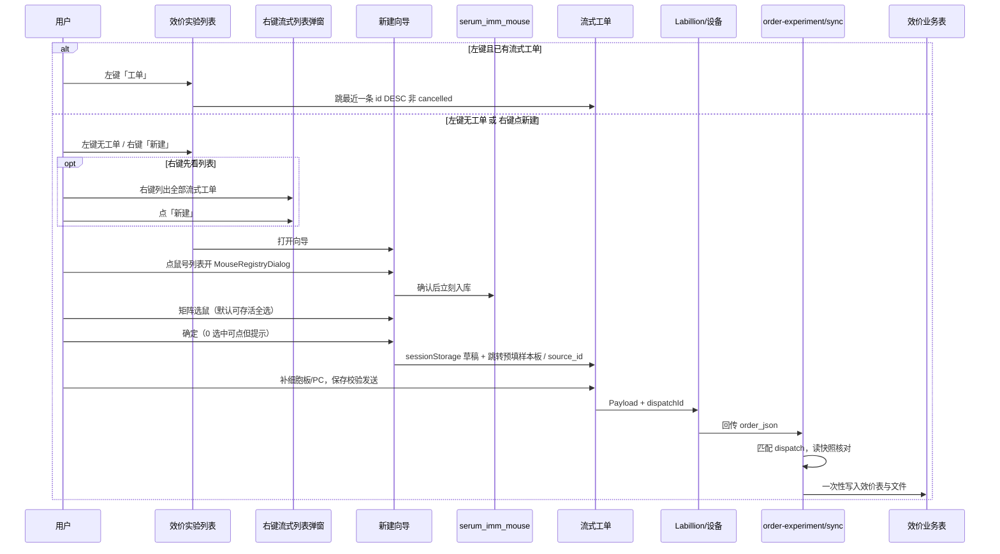

# 效价实验 → 镁伽流式工单 · 跨模块流程

> **本文**：从效价实验列表发起上机，到设备回传写入效价表的**业务链路**——入口交互、向导、字段映射、`source_id` 关联、数据权威约定、回传入库规划。  
> **流式工单模块**（校验、状态机、Labillion、API、页面）：见 [flow-work-order.md](./flow-work-order.md)。

**实现状态（摘要）**：向导与预填、流式 CRUD / 下发 / Labillion 状态同步均已落地；`order-experiment/sync` 接收 JSON 已落地，解析入库效价业务表待开发。

---

## 1. 业务全景
```text
效价实验列表（serum_titer_order）
  │
  ├─「工单」左键 / 右键（见 §5）
  │
  ├─① 新建向导：小鼠分组表 + 鼠号死活确认（写回 serum_imm_mouse）
  ├─② 新建向导：按组矩阵勾选待检测个体（默认存活全选；不落效价表）
  │
  └─③ 点「确定」→ sessionStorage 草稿 → 跳转流式工单新建页并预填
        │
        ├─ 用户补充：细胞板、PC 表、铺板细节、条码等
        ├─ 预填已含 source_id = titer_order_id，orderType = TITER（保存时一并提交）
        ├─ 保存 → 校验 → 发送 Payload（dispatchId；Labillion 推送与状态同步见 flow-work-order 文档）
        │
        └─④ 设备执行（Labillion 回调 / 主动查询 / 定时同步；页面保留手动 fallback）              │
              └─⑤ POST /api/order-experiment/sync 回传实验结果 JSON
                    │
                    └─⑥ 匹配 dispatchId → 读下发快照 → 核对 → 一次性写入效价表
                          · 效价文件归档
                          · 标靶表（serum_titer_target）
                          · PC 表（serum_titer_pc）
                          · FACS 板信息等
```

**核心原则**

- 上游唯一入口：**效价实验列表**每行右侧「工单」按钮（左键 / 右键行为不同，见 §5）。
- 能自动带来的字段尽量少而准：**实验 ID（作板级 project_no）、靶点、样本编号（鼠号）、样本板布局、订单号/名称、source_id**。
- 细胞板、PC 表、条码、`cell_keys` 等仍由用户在流式工单页手工完善（样本板对照列 NC/PC 已由效价路径预填）。
- **单一数据源**：同一业务事实只存一处，避免效价表与流式工单双写导致回传对不齐。
- 流式工单与效价工单的关联：**流式表记 `source_id`**（效价侧为 `titer_order_id`），用已有 **`orderType`** 区分来源大类（见 §4.6）。
- 回传以 **`dispatchId`（优先）** 定位下发快照，与回传 JSON 核对后 **一次性** 写入效价业务表；`orderNum` 不唯一，不能单独作主键。

---

## 2. 涉及模块与关键文件

### 2.1 上游（效价）

| 用途 | 路径 |
|------|------|
| 效价实验列表 | `bbctg_vita_web/.../Serum/titer/SerumTiterOrderList.vue` |
| 「工单」入口 | `goInstrumentOrder`（左键）/ `openInstrumentFlowList`（右键） |
| 工单列表 + 上机向导 | `bbctg_vita_web/.../Serum/titer/TiterInstrumentOrderDialogs.vue` |
| 鼠号/死活弹窗 | `bbctg_vita_web/.../Serum/shared/MouseRegistryDialog.vue` |
| 免疫编辑里同款弹窗 | `Serum/immune/SerumEdit.vue` → `openMouseRegistryDialog` |
| 小鼠分组表参考 | `SerumEdit.vue` 小鼠分组区域（向导上半抄此结构，只读） |
| 效价工单 API | `bbctg_vita_server/modules/immunology/titer/` |
| 小鼠分组 / 鼠号入库 API | `GET /serum/mouse-groups`、`POST /serum/mouse-registry/save`（`serum.project.edit` / `edit_all` 或 `serum.titer.edit` / `edit_all` 任一） |
| 按来源查流式工单 | `POST /mega-automation/flow-work-orders/by-source` |
| 小鼠数据表 | `serum_imm_mouse`（`mouse_registry` JSON：`{ mice: [{ no, sex, alive }] }`） |
| 效价工单表 | `serum_titer_order`（`titer_order_id` 唯一业务键） |
| 免疫项目 | `serum_imm_project`（`project_code`、`target_name` 等） |
| 存活鼠过滤逻辑参考 | `serumTiterConclusion.ts` → `listMiceInGroup()` |

### 2.2 中游（镁伽流式工单）

| 用途 | 路径 |
|------|------|
| 列表 / 详情 | `FlowWorkOrderList.vue`、`FlowWorkOrderDetail.vue` |
| 效价→流式预填 | `flowWorkOrderTiterUpstream.ts` |
| 后端 | `bbctg_vita_server/modules/mega_automation/` |

模块行为（校验、状态、Payload、Labillion）：[flow-work-order.md](./flow-work-order.md)。
### 2.3 下游（回传）

| 用途 | 路径 |
|------|------|
| 接收接口 | `POST /api/order-experiment/sync` |
| 文档 | [order-experiment-sync-api.md](../../temp_text/order-experiment-sync-api.md) |
| 实现 | `bbctg_vita_server/modules/order_sync/` |
| 记录表 | `order_sync`（`status=pending` 表示已接收未业务入库） |

---

## 3. 上游数据从哪里取

效价列表每一行 ≈ 一条 `serum_titer_order`，通过 `experiment_id` 关联：

```text
serum_titer_order.experiment_id
  → serum_imm_project（project_code, target_name, assay_method, …）
  → serum_imm_mouse[]（按 group_id 分组，mouse_registry / mouse_no_list）
  → serum_imm_step[]（免疫方案，含采血日期等）
```

列表项字段（`_order_to_list_item`）含：`project_id`、`project_code`、`target_name`、`experiment_id`、`titer_order_id` 等，足够作为入口与向导参数。

**鼠号与死活**

- 首选 `mouse_registry.mice[]`：`{ no, sex, alive }`，`alive === false` 为死亡。
- 无 registry 时回退解析 `mouse_no_list` 文本（见 `serumTiterConclusion.parseLegacyMouseTokens`）。
- 向导中通过 `MouseRegistryDialog` 确认后 **立刻写回 `serum_imm_mouse`**（不依赖是否跳转流式工单）。

**`titer_order_id` 生成规则（已有）**

```text
{YYYYMMDDHHmmss}-{project_code 去空格}-{0000~9999 随机四位}
```

无 `project_code` 时用 `experiment_id`，再没有则用 `NO_PROJECT`。库内唯一。  
流式工单 `source_id` 存此业务字符串，**不用**表自增 `id`。

**映射到流式工单（已实现）**

| 免疫/效价字段 | 流式工单字段 |
|---------------|--------------|
| `experiment_id` | `sample_plates[].project_no`（**不是** `project_code`） |
| `target_name` | `sample_plates[].target` |
| 选中鼠号（组序 × 组内原序） | `wells[].sample_code`（`content_type=SAMPLE`） |
| — | `orderType` = `TITER` |
| `titer_order_id` | `source_id`（保存 payload 带上；后端写一次锁定） |
| `titer_order_id` + 随机后缀 | `orderNum`（不要求库唯一，便于人工区分） |
| `project_code`-`target_name`-效价检测 | `orderName` / `base_info.orderName`（缺项目编号时用 `experiment_id`） |

---

## 4. 数据存储与权威来源

本节约定各阶段数据写哪里、以谁为准，避免「效价表一份、流式工单一份」导致回传无法对齐。

### 4.1 总原则：不双写

```text
免疫小鼠表（serum_imm_mouse）     → 鼠号个体档案 + 死活（已有，继续维护；向导改完立刻入库）
上游向导选鼠（会话内）            → 仅用于生成流式工单草稿，不落效价业务表
流式工单 content（mega_flow_work_order） → 上机前的可编辑真相（样本/细胞/PC）
流式工单 source_id + orderType     → 指回来源业务单（1:N，见 §4.6）
下发快照（mega_flow_work_order_dispatch.payload） → 发送时刻的不可变真相
回传处理                          → 快照 + 回传 JSON 核对通过后，一次性写入效价表
```

**不在** `serum_titer_order` 上单独存「待检测小鼠列表」；**不在**跳转创建页时把 PC/标靶 **提前写入** `serum_titer_target` / `serum_titer_pc`。

### 4.2 各数据项存哪里

| 数据 | 存储位置 | 说明 |
|------|----------|------|
| 鼠号、死活 | `serum_imm_mouse.mouse_registry` | 向导上半点开 `MouseRegistryDialog` 确认后 **立刻入库** |
| 本次测哪些鼠 | **不落效价表** | 下半矩阵勾选；点「确定」后通过会话传给流式新建页 |
| 实际上机样本编号 | `mega_flow_work_order.content` → `sample_plates[].wells[].sample_code` | 选中鼠号填入 SAMPLE 孔；保存工单后即持久化；**权威来源** |
| 项目号、靶点（板级） | 同上 → `sample_plates[].project_no` / `target` | **`project_no` ← `experiment_id`**；`target` ← `target_name` |
| PC 信息、细胞板、对照孔 | 同上 → `pc_infos` / `cell_plates` / wells | 用户在流式工单页补齐 |
| 来源业务单 | `mega_flow_work_order.source_id` + `orderType` | 见 §4.6 |
| 发送时完整内容 | `mega_flow_work_order_dispatch.payload` | 回传核对基准 |
| 标靶表、PC 表、FACS 板、附件 | `serum_titer_*` / `serum_file` 等 | **回传入库时一次性写入**，不提前占位 |

### 4.3 为何待检测鼠不写效价工单表

- 向导选鼠只是「生成样本板的输入」，最终可能被用户在流式页改孔位、调板。
- 若效价表也存一份，与 `sample_code` 极易不一致，回传时不知以谁为准。
- 效价工单表职责保持为批次元数据（负责人、采血日、板数、小结等），不承载上机布局。

勾选结果仅在跳转前存在于 **会话 / router state**；用户保存流式工单后，以 `content.sample_plates` 为准。

### 4.4 为何 PC/标靶不提前写入效价表

- 创建流式工单时用户尚未填完 PC、细胞板，可能取消或重发。
- 提前写入会产生空跑或半成品效价数据。
- PC/标靶在流式工单中可编辑，提前写入必然双写。

**第一版策略**：PC/标靶只在流式工单 `content` 中维护；**回传成功且与下发快照核对通过后**，再 **一次性** 写入效价业务表。

### 4.5 回传入库：快照核对 + 一次性写入

```text
POST /api/order-experiment/sync 收到 order_json
  → 用 dispatchId 定位 mega_flow_work_order_dispatch
  → 读取该次 payload 快照（发送时内容）
  → 与回传 JSON 核对关键字段（见 §8.3）
  → 核对通过：在同一业务事务中一次性写入
        · serum_titer_target（标靶）
        · serum_titer_pc（PC）
        · FACS 板 / 孔位数据
        · serum_file（图片、CSV 等）
  → order_sync.status: pending → processed
  → 核对失败：status = failed，记录原因，不写效价表
```

**权威组合**：`dispatch.payload`（发了什么）+ 回传 JSON（测出什么）→ 合并后入库。  
不以效价工单表、不以向导中间态为依据。

### 4.6 流式工单 ↔ 效价工单关联（已决）

**关系**：一条效价工单可对应 **多条** 流式工单（允许多次上机）。外键放在「多」的一侧。

**字段（流式表新增）**

| 字段 | 说明 |
|------|------|
| `source_id` | 来源业务主键，可空。效价上游创建时写入 `titer_order_id` |
| `orderType` | **已有**。在本系统中表示 **样品来源大类**（`TITER` / `PLAS` / `PCR`），工单本身都是流式实验 |

**不另加** `source_type`、`source_experiment_id`：

- `orderType` 已承担「来源大类」语义，无需重复字段。
- `experiment_id` 可经 `source_id` → `serum_titer_order` → `experiment_id` 顺链路查到。

**查询约定**

```text
查某效价下全部流式工单：
  orderType = 'TITER' AND source_id = :titer_order_id

查「最近一条」（左键跳转用）：
  同上，且 status != 'cancelled'
  ORDER BY id DESC
  LIMIT 1

手工新建（非上游）：
  orderType = 'TITER'，source_id 为空
```

**未来扩展**：其他来源（如质粒）用各自 `orderType` + 各自业务主键写入 `source_id`；同一 `orderType` 下 `source_id` 含义在文档中约定清楚即可。

**回传追溯链**

```text
dispatchId → mega_flow_work_order_dispatch
  → mega_flow_work_order（source_id, orderType）
  → serum_titer_order（titer_order_id = source_id）
  → experiment_id → 效价/免疫项目
```

---

## 5. 效价列表「工单」按钮交互（已决）

入口：`Serum/titer/SerumTiterOrderList.vue` 操作列「工单」按钮 → 转发到 `TiterInstrumentOrderDialogs.vue`（`handleLeftClick` / `handleRightClick`）；必须传入当前行（含 `titer_order_id`、`experiment_id` 等）。

### 5.1 左键

```text
查询：orderType=TITER AND source_id=本行 titer_order_id AND status != 'cancelled'
按 id 降序取最近一条

├─ 0 条 → 打开「新建向导」大弹窗（§6）
└─ ≥1 条 → 直接跳转最近一条流式工单详情
            /mega-automation/flow-work-orders/detail?id={最近工单id}
```

**「最近一个」定义（已决）**：`id` **降序**（简单、稳定）；排除 `cancelled`。

### 5.2 右键

打开 **流式工单列表弹窗**（非新建向导）：

| 行为 | 说明 |
|------|------|
| 列表内容 | 该效价工单对应的 **全部** 流式工单（`orderType=TITER` 且 `source_id=titer_order_id`） |
| 状态过滤 | **不过滤**；含 draft / sent / running / paused / completed / cancelled / failed 等，用状态标签区分 |
| 排序 | 建议 `id` 降序 |
| 左键点某一行 | 跳转该流式工单详情 |
| 「新建」按钮 | 关闭本列表弹窗 → 打开「新建向导」大弹窗（§6） |

### 5.3 权限

入口权限与效价工单 **记录编辑** 对齐（`canEditTiterOrderRecord` / `serum.titer_order.record.edit`）：

| 角色 | 左键 | 右键列表 | 「新建」/ 选鼠向导 |
|------|------|----------|-------------------|
| 有记录编辑权（本行免疫/效价负责人或 edit_all） | 无关联 → 向导；有关联 → 流式详情 `mode=edit` | 可看列表 | 可新建 |
| 无记录编辑权 | 无关联 → 提示暂无；有关联 → 流式详情 `mode=view` | 可看列表 | 隐藏新建 |

按钮本身不灰显。流式侧仍由 `mega.page.flow_work_order` / `mega.flow_work_order.edit` 再拦；本侧不另建权限点。

鼠号分组查询与鼠号明细保存为独立接口，权限与入口分开：持有 `serum.project.edit` / `serum.project.edit_all` / `serum.titer.edit` / `serum.titer.edit_all` **任一** 即可。

---

## 6. 新建向导大弹窗（已决 · 本阶段做到「确定」前）

一个大弹窗，上下两块；**同一套小鼠数据**：上表改鼠号/死活入库后，下表矩阵立即同步。

### 6.1 上半：小鼠信息表（只读抄编辑页）

- UI 参考免疫编辑页 **小鼠分组表**（组别、鼠型、数量、性别、鼠号列表等）。
- **整表不可编辑**（不能改组别、鼠型等）。
- **仅「鼠号列表」可点击** → 弹出 `MouseRegistryDialog`（与编辑页一致）。
- 在 `MouseRegistryDialog` 中确认后：
  - **立刻写回 `serum_imm_mouse`**（鼠号 + 死活入库）；
  - 刷新上表展示；
  - **同步下半矩阵**（新增/删除鼠号、死活变化影响默认选中与可选状态）。
- 入库不依赖是否最终跳转流式工单——即使用户只改鼠号关掉向导，免疫侧数据也已更新。

### 6.2 下半：待检测鼠选择矩阵

- **按组独立表格**（列数固定为 10；行标 A/B/…），非合并大表。
- 组头展示组别、品系与 `已选/存活`。
- **不可编辑鼠号**；支持拖拽划选（按起点状态决定加入/取消）与单击切换。
- **默认**：所有 `alive !== false` 的鼠选中；死亡鼠展示但不可选。
- 与上表 **纯前端同步**：鼠号入库后重算矩阵；已选集合保留原勾选，新出现的存活鼠默认勾选。

### 6.3 「确定」按钮

| 情况 | 行为 |
|------|------|
| 已选 ≥1 只 | 写入草稿 → 跳转流式工单编辑页并预填 |
| 无鼠号 / 全死 / 0 选中 | **仍可点确定**，先 **提示确认**（允许只补做对照组），再同上 |

草稿键：`sessionStorage` → `titer-instrument-wizard-draft`（进入详情后立即消费并清除）。  
跳转：`MegaFlowWorkOrderDetail`，`query = { mode: edit, prefill: titer-wizard, n: <timestamp> }`（`n` 保证 KeepAlive 下重复进入会重新灌板）。

### 6.4 向导输出（会话，不落效价表）

```json
{
  "experiment_id": "EXP…",
  "titer_order_id": "20260716140322-ABC123-0847",
  "project_code": "…",
  "target_name": "…",
  "groups": [
    {
      "group_id": "G1",
      "selected_mouse_nos": ["M001", "M002"]
    }
  ]
}
```

- `groups` 顺序 = 向导上表组顺序；组内 `selected_mouse_nos` = 该组原鼠序过滤已选（**不重排、不去重**；选鼠键为 `groupId::mouseIndex`，同鼠号可重复勾选）。
- 实现：`TiterInstrumentOrderDialogs.vue` → `buildSelectionPayload` / `handleConfirm`。

---

## 7. 点「确定」之后（已实现）

**实现文件**：`flowWorkOrderTiterUpstream.ts`（灌板与字段预填）、`FlowWorkOrderDetail.vue`（消费草稿）、`flowWorkOrderModel.ts`（保存 payload 含 `source_id`）。

**跳转**：`/mega-automation/flow-work-orders/detail?mode=edit&prefill=titer-wizard&n=…`（无 `id`，本地草稿模式）。

### 7.1 自动预填

1. **样本板布局（仅效价→流式路径，不是流式工单全局默认布局）**
   - 每板第 **1 列全 NC**、第 **12 列全 PC**（A–H）。
   - 样本孔仅 **A02–A11、E02–E11**（每板 20 孔）；其余孔 **BLANK**。
   - 鼠号按草稿顺序连续装填：同组相邻、装满一板再开下一板；**不**按组拆板、**不**插组间空位。
   - 0 只鼠仍生成 **1** 板（仅 NC/PC + 空孔，便于只补对照）。
2. **板级字段**：`project_no` ← `experiment_id`；`target` ← `target_name`。
3. **工单字段**：`orderType = TITER`；`source_id = titer_order_id`；`orderNum = {titer_order_id}-{4位随机}`；`orderName = {project_code}-{target_name}-效价检测`（缺项目编号用 `experiment_id`）。
4. **不预填**：细胞板内容、PC 表、`cell_keys`、条码等，由用户在流式页手工补。

### 7.2 保存与关联

- `buildFlowWorkOrderSavePayload` 携带 `source_id`；后端对已有 `source_id` **写一次锁定**（不可改成别的来源）。
- 复制工单时清空 `source_id`，避免误挂到同一效价单。

用户完成后进入流式工单标准流程（保存 → 校验 → 发送 → 设备执行）。
---

## 8. 下游：效价数据回传（接收已实现，业务处理待开发）

### 8.1 当前能力

`POST /api/order-experiment/sync`（`multipart/form-data`：`trace_id` + `order_json` 文件）

- 校验 JSON、落盘、写 `order_sync`，`status=pending`。

### 8.2 计划中的业务处理

与 §4.5 一致：以 **下发快照为主、回传为辅**，核对通过后 **一次性** 写入效价业务表。

1. 用 **`dispatchId`** 定位下发记录。  
2. 读 `payload` 快照并与回传 JSON 核对；失败则不写效价表。  
3. 合并后一次性写入标靶 / PC / FACS / 文件；`order_sync` → `processed`。  
4. 经 `source_id` → `serum_titer_order` → `experiment_id` 定位免疫实验。

### 8.3 回传 JSON 与下发 Payload 的核对关系

| 下发（Payload 快照） | 回传（order_json） | 核对说明 |
|---------------------|-------------------|----------|
| `dispatchId` | 回传内字段（**协议待约定**） | 主键匹配 |
| `orderNum` | `order_infos[].order_no` | 辅助核对（回传接口仍用其自身字段名） |
| `project_no` / `target` | `project_infos[].project_no` / `target` | 必须一致 |
| `orderType: TITER` | `project_infos[].data_type` | 必须一致（回传接口仍用其自身字段名） |
| `sample_code`（鼠号） | `detect_board_infos[].sample_code` / `well_infos[].sample_name` | 映射层统一命名 |
| `cell_plates` | `cell_board_infos[]` | 结构对照 |
| （下发不含） | `detect_board_infos[].barcode` | 设备产生 |

---

## 9. 端到端数据流（简图）



---

## 10. 已决 / 待定清单

### 10.1 已决

| # | 议题 | 结论 |
|---|------|------|
| 1 | 谁记关联 | 流式表记 `source_id`；效价上游写 `titer_order_id` |
| 2 | 来源大类 | 用已有 `orderType`（样品来源）；不加 `source_type` |
| 3 | experiment_id 冗余 | **不加** `source_experiment_id`，顺链路查 |
| 4 | 1:N | 一条效价可对应多条流式工单 |
| 5 | 「最近一个」 | `id` 降序；排除 `cancelled` |
| 6 | 右键列表 | 展示全部状态，不过滤 |
| 7 | 鼠号确认入库 | `MouseRegistryDialog` 确认后 **立刻** 写 `serum_imm_mouse` |
| 8 | 选鼠落库 | **不**写效价表；只进流式 `sample_code` |
| 9 | 0 选中确定 | **可点**，但提示（可只补对照） |
| 10 | PC/标靶提前写入效价表 | **不**；回传核对快照后一次性入库 |
| 11 | 权限 | 第一版先简单实现 / 暂不考虑，功能后再完善 |
| 12 | 选鼠键 | `groupId::mouseIndex`（同鼠号可独立勾选；payload 可含重复鼠号） |
| 13 | 样本板布局 | 列1 NC、列12 PC；样本仅 A02–A11 / E02–E11；连续装填、同组相邻 |
| 14 | `project_no` | ← **`experiment_id`**（不是 `project_code`） |
| 15 | `orderNum` | `{titer_order_id}-{随机}`；库不强制唯一 |
| 16 | `orderName` | `{project_code}-{target_name}-效价检测` |
| 17 | 预填传递 | `sessionStorage` 草稿 + `prefill=titer-wizard`；进详情即消费清除 |

### 10.2 仍待定（后续）

| # | 问题 | 影响 |
|---|------|------|
| 1 | 回传 JSON 是否含 `dispatchId` | 设备协议 |
| 2 | `secondary_antibody` 默认值 | 样本板字段（当前创建默认「人」） |
| 3 | 上游相关权限点细化 | 系统管理 |
| 4 | 死亡鼠在矩阵中是否允许手动选中 | **已决：不可选，灰显**（保留备查） |

---

## 11. 建议实施顺序

### 已完成

1. ~~**`mega_flow_work_order` 增加 `source_id`**~~  
2. ~~**效价列表「工单」左键 / 右键**~~  
3. ~~**新建向导大弹窗**~~  
4. ~~**`GET /api/serum/mouse-groups`、`POST /api/serum/mouse-registry/save`**~~  
5. ~~**`POST /api/mega-automation/flow-work-orders/by-source`**~~  
6. ~~**点「确定」→ 跳转流式新建并预填**~~（布局 / 字段 / `source_id`，见 §7）

已有库升级 SQL：

```sql
ALTER TABLE mega_flow_work_order
  ADD COLUMN source_id VARCHAR(128) NULL COMMENT '来源业务主键' AFTER orderType,
  ADD KEY idx_mega_flow_work_order_source (orderType, source_id);
```

### 后续

7. 回传处理：快照核对 → 一次性写效价表。