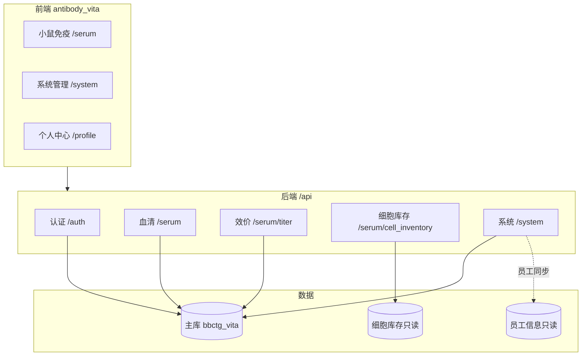

# 项目总览

## 1. 系统定位

**Antibody Forge**（内部产品名 **Vita**）是百奥赛图抗体研发相关的 Web 系统，当前以**免疫部小鼠免疫 / 血清实验**为核心业务，并配套**系统管理**（用户、角色、权限、操作日志、功能开关）。

设计目标：

- 从旧系统迁移到 **FastAPI + Vue 3（Vben Admin）** 技术栈；
- 权限可配置、接口可审计；
- 支持**账号密码**与**云之家 ticket** 登录；
- 配置与运行时文件与代码仓库分离，便于 local / test / prod 分环境部署。

## 2. 仓库结构

```text
Antibody_Forge/
├── bbctg_vita_server/     # Python 后端
├── bbctg_vita_web/        # 前端 monorepo（业务应用在 apps/antibody_vita）
├── config/                # local | test | prod 环境配置
├── repository/            # 上传、导出、日志（gitignore）
└── docs/                  # 项目文档
```

## 3. 业务模块（当前已实现）



| 模块 | 前端路由 | 后端前缀 | 能力摘要 |
|------|----------|----------|----------|
| 小鼠免疫 | `/serum/*` | `/api/serum` | 项目列表/详情/编辑、状态与笼位、小鼠导出 |
| 效价 | `/serum/titer` | `/api/serum/titer` | 靶点/阳性对照、FACS 板、效价附件 |
| 细胞库存 | `/serum/cell` | `/api/serum/cell_inventory` | 查询外部细胞库、制备状态 |
| 系统管理 | `/system/*` | `/api/system` | 用户、角色、权限包、个人覆盖、日志、功能开关 |
| 个人中心 | `/profile` | `/api/auth/user/*` | 个性名片、改密（组织字段只读） |
| 认证 | 登录页 | `/api/auth` | 密码登录、云之家、JWT、`/user/info` |

前端开发时 Serum 业务请求走 `/serum-api`，由 Vite 代理重写为后端 `/api`（与 Vben 框架的 `/api` 并存）。

## 4. 技术栈

| 层级 | 选型 |
|------|------|
| 后端 | Python 3、FastAPI、SQLAlchemy、APScheduler |
| 前端 | Vue 3、Vite、Element Plus、Vben Admin 5、`accessMode: frontend` |
| 数据库 | MySQL（主库）；细胞库、员工库为独立只读连接 |
| 认证 | JWT（`Authorization: Bearer`） |
| 响应格式 | 框架接口 `code: 0`（Vben）；Serum 业务接口 `code: 20000` |

## 5. 规划边界（刻意不做或未做）

以下能力**当前版本不包含**或仅预留，避免误解为缺失 bug：

| 项 | 现状 |
|----|------|
| 菜单落库 | 菜单结构在前端路由 `meta` 维护；`sys_feature_flag` 仅控制菜单/任务**显隐与排序** |
| 站内消息/邮件 | 未建表，未来独立 `notification` 模块 |
| `sys_user` 组织字段 | 仅展示与筛选，**不参与**权限计算 |
| 接口级自动鉴权 | `sys_permission_api` 用于**操作日志归类**，不替代 `require_permission` |
| Docker 一键部署 | 文档以 systemd + Nginx 为主路径 |

## 6. 定时任务

| 任务 ID | 默认 cron | 作用 |
|---------|-----------|------|
| `employee_profile_sync` | 每天 00:30 | 从外部员工库同步姓名、部门等资料（不同步角色/密码） |
| `serum_auto_update_status` | 每天 01:00 | 自动更新血清实验状态 |

`APP_ENV=prod` 或 `ENABLE_SCHEDULER=true` 时启动；local/test 默认关闭。调度参数可读 `sys_feature_flag` 中 `job.*` 配置。

## 7. 相关文档

- 权限完整逻辑 → [auth-permissions.md](./auth-permissions.md)
- 后端目录约定 → [backend-structure.md](./backend-structure.md)
- 部署与配置 → [deploy.md](./deploy.md)
